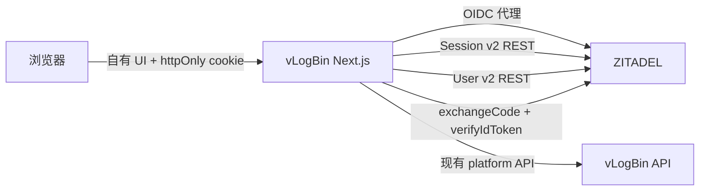
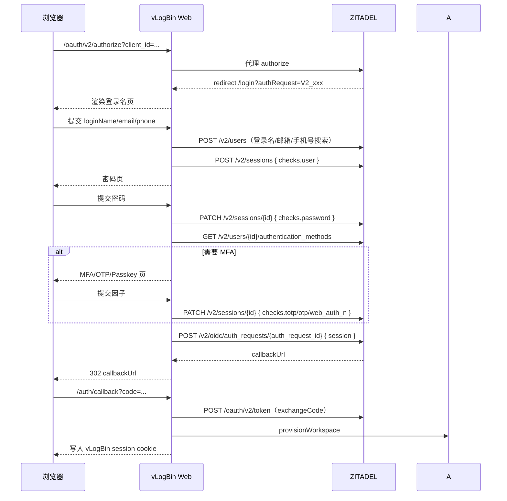

# vLogBin 自建登录页 + ZITADEL Session API 技术方案（源码核对版）

> 状态：设计定稿基线，基于 `third-party/zitadel` 源码逐项核对。
> 定位：vLogBin 提供与品牌一致的统一登录页，ZITADEL 继续作为独立身份引擎，vLogBin 只通过公开 Session API / OIDC API / User API 与其交互。
> 合规边界：不修改、不内嵌 ZITADEL AGPL 核心源码。`proto/` 与 `apps/docs/` 为 Apache-2.0，`apps/login/`、`packages/zitadel-client/`、`packages/zitadel-proto/` 为 MIT，可作为接口与实现参考；法律结论以专业顾问意见为准。

## 1. 代码核对结论

### 1.1 版本基线

仓库快照同时包含：

- `proto/zitadel/session/v2/*`：正式版 Session API，本方案唯一使用目标。
- `proto/zitadel/session/v2beta/*`：已在 proto 注释中标记 deprecated，将在下个 major 版本移除，禁止新代码依赖。
- `backend/v3/`：新关系型架构，Session API 的 `ListSessions` / `DeleteSession` 在该特性开启时走新实现；对外契约不变。

仓库没有可用的版本号常量，但 `apps/docs` 内含 v2.70.0 benchmark，且代码已包含 `backend/v3`。上线前必须对实际部署的 ZITADEL 版本执行契约探针测试，锁定当前版本行为。

### 1.2 Session API 契约表

源码依据：`proto/zitadel/session/v2/session_service.proto`、`internal/api/grpc/session/v2/server.go`、`internal/api/grpc/session/v2/session.go`、`internal/api/grpc/session/v2/query.go`。

| 操作 | REST 路径 | HTTP | 权限要求 | 关键说明 |
| --- | --- | --- | --- | --- |
| CreateSession | `/v2/sessions` | POST 201 | `session.write` | 返回 `sessionId` + 最新 `sessionToken` + `challenges` |
| SetSession | `/v2/sessions/{session_id}` | PATCH | `session.write` | `session_token` 字段已 deprecated 且被忽略；响应轮换 token |
| GetSession | `/v2/sessions/{session_id}` | GET | 见源码注释 | 可传 `sessionToken` 替代权限 |
| ListSessions | `/v2/sessions/search` | POST | `session.read` 或自有 session | 常用 `idsQuery` 实现账号选择器 |
| DeleteSession | `/v2/sessions/{session_id}` | DELETE | `session.delete` 或自有 session | 可传 `sessionToken` 替代权限 |
| GetAuthRequest | `/v2/oidc/auth_requests/{auth_request_id}` | GET | `authenticated` | OIDC 授权请求信息 |
| CreateCallback | `/v2/oidc/auth_requests/{auth_request_id}` | POST | `session.link` | 用 session 换回调 URL（含 code） |
| AddHumanUser | `/v2/users/human` | POST | `user.write` | deprecated；注册推荐改用 `POST /v2/users/new` |
| CreateUser | `/v2/users/new` | POST | `user.write` | 当前非 deprecated 的用户创建入口 |
| ListUsers | `/v2/users` | POST | `authenticated` | 登录名/邮箱/手机号搜索，返回 userId 后再建 session |

### 1.3 认证主体与权限

源码依据：`cmd/defaults.yaml`、`cmd/setup/03.go`、`internal/command/instance.go`、`apps/login/src/lib/service.ts`。

ZITADEL 官方 Login App 使用一个带 `IAM_LOGIN_CLIENT` 角色的机器用户：

- 首次初始化时创建机器用户并授予 `IAM_LOGIN_CLIENT`。
- `IAM_LOGIN_CLIENT` 权限含 `session.read`、`session.write`、`session.link`、`session.delete`、`user.read`、`user.write`、`user.credential.write`、`user.passkey.write` 等。
- 初始化时可输出机器用户 PAT（`ZITADEL_FIRSTINSTANCE_LOGINCLIENTPATPATH` / `ZITADEL_LOGINCLIENT_PAT`）。
- 官方实现还支持系统用户 JWT、Login Client Key、`ZITADEL_SERVICE_USER_TOKEN` 三种凭据；vLogBin 推荐使用独立 PAT，密钥不进前端。

### 1.4 Session token 语义

源码依据：`internal/api/authz/session_token.go`、`internal/command/session.go`、`internal/authz/repository/eventsourcing/eventstore/token_verifier.go`。

- token 内部格式为 `sess_<sessionID>:<tokenID>`，用 ZITADEL OIDC 加密密钥加密后返回给调用方。
- 每次 `CreateSession` / `SetSession` 都会生成新 token，旧 token 立即失效。
- token 可作为 `Authorization: Bearer <token>` 调用 ZITADEL API，但只对“已完成主认证”的 session 有效；MFA 缺失会被拒绝。
- token 不能直接用于 OAuth2 Token Introspection；要拿标准 access/id token 必须完成 OIDC `CreateCallback` 后由客户端走 `/oauth/v2/token`。
- `GetSession` / `DeleteSession` 可用 body 中的 `sessionToken` 替代权限校验。

### 1.5 Checks、Challenges 与 Factors

源码依据：`proto/zitadel/session/v2/session.proto`、`proto/zitadel/session/v2/challenge.proto`、`proto/zitadel/session/v2/session_service.proto`、`internal/command/session.go`。

| 类型 | 说明 |
| --- | --- |
| `checks.user` | 仅支持 `user_id` 或 `login_name`；**不直接支持 email/phone**，必须先用 `ListUsers` 解析为 userId |
| `checks.password` | 依赖 user 已确认；失败返回 `COMMAND-3M0fs`，锁定返回 `COMMAND-JLK35` / `COMMAND-SFA3t` |
| `checks.totp` | 6 位 code，依赖 user |
| `checks.otp_sms` / `otp_email` | 一次性 code，依赖 user；需要先请求对应 challenge |
| `checks.web_auth_n` | 需要先前请求 WebAuthN challenge 并完成浏览器断言 |
| `checks.idp_intent` | 用 IDP intent id/token 完成外部身份确认 |
| `checks.recovery_code` | 验证后作废 |
| `challenges.web_auth_n` | 返回 `PublicKeyCredentialRequestOptions`，需传 `domain` |
| `challenges.otp_sms` | 可 `returnCode` 或由 ZITADEL 发送 |
| `challenges.otp_email` | 支持 `send_code.url_template` 或 `return_code` |
| `user_agent` | `fingerprintId`、`ip`、`description`、`header`，用于设备绑定与审计 |
| `lifetime` | 必须大于 0；未设置则不过期；每次 Set 会重算 `expirationDate` |

### 1.6 错误契约

源码依据：`internal/api/grpc/gerrors/zitadel_errors.go`、`proto/zitadel/message.proto`、`proto/zitadel/error/v2/error.proto`、`apps/login/src/lib/grpc/interceptors/error-classification.ts`。

推荐只依赖稳定 `id` / `slug`，不展示英文 message：

| 场景 | 稳定标识 | 语义 |
| --- | --- | --- |
| 密码错误 | `COMMAND-3M0fs` | `Errors.User.Password.Invalid` |
| 用户锁定 | `COMMAND-JLK35` / `COMMAND-SFA3t` | `Errors.User.Locked` |
| session 已过期 | `COMMAND-Hkl3d` | `Errors.Session.Expired` |
| session 已终止 | `COMMAND-Hewfq` | `Errors.Session.Terminated` |
| session 不存在 | `QUERY-SFeaa` / `COMMAND-Flk38` | `Errors.Session.NotExisting` |
| token 无效 | `COMMAND-sGr42` | `Errors.Session.Token.Invalid` |
| WebAuthN 无 challenge | `COMMAND-Ioqu5` | `Errors.Session.WebAuthN.NoChallenge` |
| 用户未激活 | `Errors.User.NotActive` | 用户状态检查 |

Connect/gRPC 错误详情可能携带 `CredentialsCheckError.failed_attempts`，REST JSON 中对应 `details[].failedAttempts`，用于登录页展示剩余次数提示。客户端统一按 gRPC code → HTTP 映射处理：400/401/403/404/409/429/5xx。

### 1.7 官方 Login App 架构（已核对）

源码依据：`apps/login/src/proxy.ts`、`apps/login/src/lib/server/cookie.ts`、`apps/login/src/lib/server/session.ts`、`apps/login/src/lib/service.ts`、`apps/docs/content/guides/integrate/login-ui/login-app.mdx`。

- Next.js 应用，服务端持有 PAT 调用 ZITADEL Connect/Session API。
- 浏览器只持有 `sessions` httpOnly cookie，内容是 `[{id, token, loginName, organization, timestamps}]`。
- `/.well-known/*`、`/oauth/*`、`/oidc/*`、`/idps/callback/*`、`/saml/*` 由中间件重写到 ZITADEL。
- 登录页把 `authRequest` 或 `requestId` 一直带在 URL，最终通过 `OIDCService.CreateCallback` 换成回调 URL。
- 服务端为每个 step 调用 `createSession` / `setSession`，并把响应中的新 token 写回 cookie。

## 2. 推荐架构



关键决策：

1. 新增 `lib/auth/zitadel-session.ts` 作为唯一 Session API 适配层，禁止页面直接拼请求。
2. 默认走 REST JSON，与 proto/grpc-gateway 对齐；字段名用 proto JSON 的 lowerCamelCase。
3. 浏览器不接触 ZITADEL session token。登录流程中的 `sessionId + sessionToken` 存入独立 httpOnly `login_flow` cookie，并使用现有 `SESSION_SECRET` 派生密钥做 AES-256-GCM 加密。
4. 保持 `AUTH_MODE=oidc` 的现有授权码链路作为兜底，用功能开关渐进切换，不一次性删除。
5. 最终 token 仍通过标准 OIDC `code → /oauth/v2/token` 获取，Session token 只用于“当前登录流程状态”和 `CreateCallback`。

## 3. 登录流程



各步骤源码对照：

| 步骤 | vLogBin 新实现 | ZITADEL 官方参考 |
| --- | --- | --- |
| 代理 authorize | `lib/auth/oidc.ts` 保留 | `apps/login/src/proxy.ts` |
| 登录名搜索 | `zitadel-session.searchUsers` | `apps/login/src/lib/zitadel.ts` 的 `searchUsers` |
| 创建 session | `zitadel-session.createSession` | `apps/login/src/lib/server/session.ts` |
| 密码检查 | `zitadel-session.setSession` | `apps/login/src/lib/server/password.ts` |
| OTP challenge/check | `zitadel-session.setSession` | `apps/login/src/components/login-otp.tsx` |
| Passkey challenge/check | `zitadel-session.setSession` | `apps/login/src/lib/server/passkeys.ts` |
| 完成 OIDC | `zitadel-session.createCallback` | `apps/login/src/lib/oidc.ts` |

## 4. 注册流程

1. `/signup` 改为 vLogBin 自有页面，收集邮箱、姓名、可选密码。
2. 服务端先调 `GET /v2/settings/login` 确认 `allowRegister` / `allowLocalAuthentication`。
3. 调 `POST /v2/users/new`（`CreateUser`）创建 human；官方 Login App 当前仍使用 deprecated `POST /v2/users/human`，vLogBin 应直接使用非 deprecated 入口。
4. 创建后因投影尚未就绪，官方实现有“NotFound 重试”模式；vLogBin 同样实现指数退避重试建 session。
5. 按用户配置创建 session：有密码则一次性 `user + password` check，无密码则先 user check 后进入验证码/Passkey 初始化页。
6. 完成 OIDC `CreateCallback` 后，沿用现有 `provisionWorkspace` 事务初始化 workspace。

## 5. 契约层

### 5.1 环境变量

| 变量 | 必填 | 说明 |
| --- | --- | --- |
| `AUTH_MODE` | 是 | `oidc`（默认）/ `operator-token` / `oidc-custom-login` |
| `ZITADEL_URL` | 是 | ZITADEL issuer/API 根地址 |
| `ZITADEL_API_URL` | 自建登录模式必填 | Session API 基址，默认同 `ZITADEL_URL` |
| `ZITADEL_CLIENT_ID` | 是 | OIDC 应用 client id |
| `ZITADEL_CLIENT_SECRET` | 按应用 | confidential client 必填 |
| `ZITADEL_LOGIN_CLIENT_PAT` | 自建登录模式必填 | 带 `IAM_LOGIN_CLIENT` 的机器用户 PAT |
| `ZITADEL_LOGIN_UI_MODE` | 否 | `redirect`（当前行为）/ `session-api`（渐进切换） |
| `ZITADEL_TRUSTED_DOMAIN` | 是 | 与 `APP_BASE_URL` 同源，注册进 Trusted Domains |
| `SESSION_SECRET` | 是 | 加密 login_flow cookie 与现有 session |

### 5.2 适配层 API

```ts
export interface ZitadelSessionClient {
  searchUsers(input: SearchUsersInput): Promise<UserHit[]>;
  createSession(input: CreateSessionInput): Promise<CreateSessionResult>;
  setSession(input: SetSessionInput): Promise<SetSessionResult>;
  getSession(input: GetSessionInput): Promise<ZitadelSession>;
  listSessions(ids: string[]): Promise<ZitadelSession[]>;
  deleteSession(input: DeleteSessionInput): Promise<void>;
  getAuthRequest(id: string): Promise<AuthRequest>;
  createCallback(input: { authRequestId: string; sessionId: string; sessionToken: string }): Promise<{ callbackUrl: string }>;
}
```

所有返回值用 zod 校验后再进入业务层；服务端错误统一转成 `ZitadelApiError { code, id, message, failedAttempts? }`。

### 5.3 关键请求示例

创建 session（登录名已解析为 userId）：

```json
POST /v2/sessions
Authorization: Bearer <PAT>
{
  "checks": {
    "user": { "userId": "283399833706168162" }
  },
  "userAgent": {
    "fingerprintId": "f6d3...",
    "ip": "203.0.113.9",
    "description": "Chrome 139, macOS 15.2",
    "header": { "user-agent": { "values": ["Mozilla/5.0 ..."] } }
  },
  "lifetime": "86400.000000000s"
}
```

密码检查：

```json
PATCH /v2/sessions/283399833706168162
Authorization: Bearer <PAT>
{
  "checks": { "password": { "password": "..." } }
}
```

完成 OIDC：

```json
POST /v2/oidc/auth_requests/V2_224908753244265546
Authorization: Bearer <PAT>
{
  "session": {
    "sessionId": "283399833706168162",
    "sessionToken": "<最后一次响应中的 token>"
  }
}
```

### 5.4 安全约束

- `sessionToken` 只在服务端出现；login_flow cookie 加密存储，`SameSite=Lax`、`HttpOnly`、`Secure`。
- 每次 `setSession` 后必须把新 token 回写 cookie，绝不复用旧 token。
- state/PKCE/verifier 继续用现有 httpOnly cookie，OIDC state 恒定校验。
- 设备指纹用 `fingerprintId` cookie，随 session `user_agent` 上报，支持账号选择器与异常登录审计。
- MFA 判断放在 vLogBin 服务端：读取 session factors + `ListUserAuthMethodTypes` + LoginSettings，不允许前端决定“是否已充分认证”。
- 失败密码/OTP 的锁定与 tarpit 交给 ZITADEL 执行，vLogBin 只展示 `failedAttempts`，不自己实现爆破保护。
- 登录页错误文案按稳定 id 映射，禁止输出 ZITADEL 英文原始 message。

## 6. 测试与交付拆分

### 6.1 测试矩阵

- 单元：zod schema、错误映射、token cookie 加解密、policy 判断。
- 集成：mock ZITADEL REST 的 create/set/get/delete/callback 全链路。
- E2E：真实 ZITADEL + Playwright，覆盖登录名、密码、TOTP、OTP email/SMS、Passkey、登出、过期、账号选择器。
- 契约探针：对目标 ZITADEL 版本实际调用五个 Session 端点，锁定响应字段与错误 id，作为 CI 第一步。

### 6.2 分批上线

1. P0：新增 `zitadel-session.ts` + 契约探针 + 配置开关，不改现有页面。
2. P1：登录名 + 密码页替换，`AUTH_MODE=oidc-custom-login` 下启用，失败自动回退原 OIDC 跳转。
3. P2：MFA（TOTP/OTP/Passkey/U2F）与账号选择器。
4. P3：注册/邮箱验证/Passkey 初始化，接入 `provisionWorkspace`。
5. P4：全量灰度，删除或冻结旧跳转路径，补充回归基线。

## 7. 风险清单

- `v2beta` 会在下个 major 移除：任何新代码不得引用 `session/v2beta`。
- REST 与 Connect 并存：以自托管版本契约探针为准，不假定 grpc-gateway 字段与 Connect 完全一致。
- `ListUsers` 搜索依赖组织上下文与登录策略，搜索失败必须走“防用户枚举”文案路径。
- Session API 与 OIDC 是配合关系：不要用 Session token 替代标准 OAuth token。
- AGPL 边界：vLogBin 只依赖 API 契约，参考实现限 MIT 的 `apps/login` 与 Apache-2.0 的 `proto`；生产前请法务复核。
