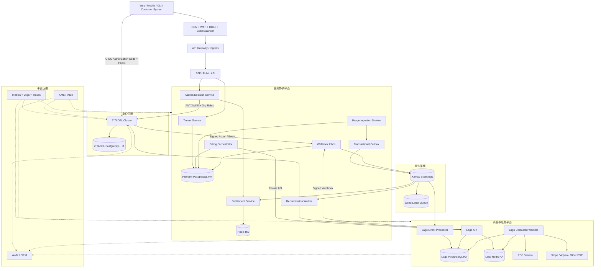
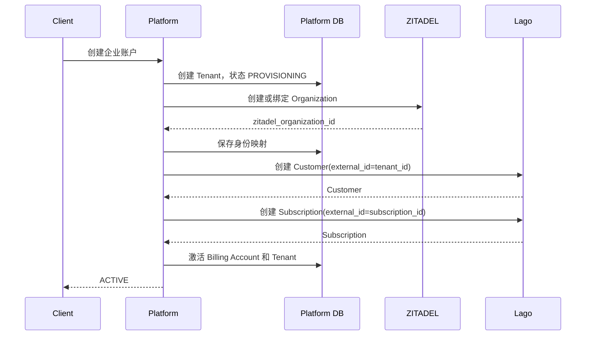
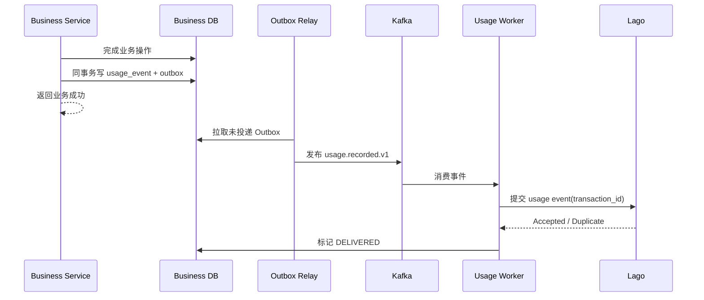

# ZITADEL + Lago 平台级生产架构设计方案

文档版本：v1.0  
适用场景：多租户 B2B SaaS、订阅制、用量计费、混合计费  
架构基线：Kubernetes + PostgreSQL + Redis + Kafka  
设计目标：身份与账务解耦、财务级幂等、跨可用区高可用、可审计、可回滚

---

## 1. 架构结论

推荐采用“三平面”架构：

1. **身份平面**：ZITADEL  
   管理用户、组织、机器身份、登录、MFA、SSO、RBAC、身份审计。

2. **商业平面**：Lago  
   管理客户、套餐、订阅、用量、额度、账单、发票、支付与催收。

3. **业务协调平面**：自建 Platform Control Plane  
   管理内部租户、两套系统 ID 映射、开户状态机、权限与权益组合、用量投递、Webhook 收件箱和补偿任务。

核心约束：

> ZITADEL 与 Lago 不直接互调。所有跨系统状态由业务协调层编排。

这可以避免身份事件误删账务数据、网络抖动导致半开户，以及外部系统 ID 渗透到核心领域模型。

---

## 2. 目标与非目标

### 2.1 目标

- 支持一个用户加入多个组织；
- 支持企业 SSO、MFA、Passkey 和机器账户；
- 支持订阅、按量、阶梯价、预付额度和混合计费；
- 身份授权与商业权益同时生效；
- 所有跨系统写入可重试且不重复；
- 单个依赖故障不拖垮核心业务；
- 支持灰度发布、多可用区部署和灾难恢复；
- 账务与身份变更全链路可审计。

### 2.2 非目标

- 不修改 ZITADEL 或 Lago 的核心领域模型；
- 不将 Lago 作为业务数据库；
- 不把动态额度直接写入 JWT；
- 不追求 ZITADEL、业务数据库和 Lago 之间的分布式强事务；
- 不允许浏览器直接调用 Lago 管理 API 或上报计费用量。

---

## 3. 总体架构



---

## 4. 系统职责与真相源

| 数据 | 唯一真相源 | 本地保存方式 |
|---|---|---|
| 用户身份、凭证、MFA | ZITADEL | 只保存 `zitadel_user_id` |
| 组织成员关系、项目角色 | ZITADEL | 可缓存投影，不反向修改 |
| 内部租户和资源归属 | Platform DB | 主数据 |
| ZITADEL 与 Lago ID 映射 | Platform DB | 主数据 |
| Customer、Plan、Subscription | Lago | 本地只保存状态投影 |
| 商业权益 | Lago + Platform 规则 | 版本化快照 |
| 原始业务用量 | Platform Event Store | 至少一次投递 |
| 聚合费用、发票、付款 | Lago | 本地保存查询投影 |
| 财务凭证与历史账单 | Lago/财务系统 | 不随身份删除 |
| 跨系统流程状态 | Platform DB | Saga 状态机 |

---

## 5. 租户与账务模型

### 5.1 推荐映射

```text
ZITADEL Instance
└── ZITADEL Organization
      └── Platform Tenant
            └── Billing Account
                  ├── Lago Customer
                  └── Lago Subscription(s)
```

默认是一对一，但数据模型必须支持：

- 多个身份组织共用一个付款主体；
- 一个组织拥有多个订阅；
- 总部统一付款、子组织独立使用；
- 租户迁移账务账户；
- 历史订阅和发票永久保留。

### 5.2 核心表

```sql
tenant (
  id                         uuid primary key,
  status                     varchar not null,
  legal_name                 varchar,
  created_at                 timestamptz not null
);

identity_organization (
  tenant_id                  uuid not null,
  zitadel_organization_id    varchar not null unique,
  status                     varchar not null,
  primary key (tenant_id, zitadel_organization_id)
);

billing_account (
  id                         uuid primary key,
  tenant_id                  uuid not null,
  lago_customer_external_id  varchar not null unique,
  status                     varchar not null,
  currency                   char(3) not null,
  billing_timezone           varchar not null,
  version                    bigint not null
);

billing_subscription (
  id                            uuid primary key,
  billing_account_id            uuid not null,
  lago_subscription_external_id varchar not null unique,
  plan_code                     varchar not null,
  status                        varchar not null,
  effective_from                timestamptz not null,
  effective_to                  timestamptz,
  remote_version                bigint
);

entitlement_snapshot (
  tenant_id                  uuid not null,
  entitlement_code           varchar not null,
  value                      jsonb not null,
  source_version             bigint not null,
  valid_until                timestamptz not null,
  primary key (tenant_id, entitlement_code)
);

integration_outbox (
  id                         uuid primary key,
  aggregate_type             varchar not null,
  aggregate_id               uuid not null,
  event_type                 varchar not null,
  event_version              int not null,
  payload                    jsonb not null,
  status                     varchar not null,
  attempts                   int not null,
  next_attempt_at            timestamptz
);

integration_inbox (
  source                     varchar not null,
  external_event_id          varchar not null,
  payload_hash               varchar not null,
  processing_status          varchar not null,
  received_at                timestamptz not null,
  primary key (source, external_event_id)
);

usage_event (
  id                         uuid primary key,
  tenant_id                  uuid not null,
  transaction_id             varchar not null,
  metric_code                varchar not null,
  occurred_at                timestamptz not null,
  quantity                   decimal,
  properties                 jsonb,
  delivery_status            varchar not null,
  unique (tenant_id, transaction_id)
);
```

禁止使用以下字段作为跨系统主键：

- Email；
- 用户名；
- 组织名称；
- 套餐显示名称；
- Lago 内部数据库 ID。

---

## 6. 认证与访问决策

### 6.1 用户认证

Web 和移动端统一采用：

- OIDC Authorization Code；
- PKCE；
- 短生命周期 Access Token；
- Refresh Token Rotation；
- MFA/Passkey 按风险策略启用；
- 禁止 Implicit Flow；
- Refresh Token 不进入浏览器可读存储。

ZITADEL 已在 HTTP 鉴权链路中执行 token、组织上下文和角色映射验证，代码依据见 [auth_interceptor.go](/Users/mg/Workspace/vLogBin/zitadel/internal/api/http/middleware/auth_interceptor.go:66)。

### 6.2 机器身份

服务间调用优先级：

1. `private_key_jwt`；
2. OAuth Client Credentials；
3. 短期工作负载身份；
4. 最后才使用长期 API Key。

Lago API Key 只能存储在 Vault/KMS，不进入前端、日志或普通配置文件。

### 6.3 权限与权益组合

每个业务请求执行双重判定：

```text
允许访问 =
    ZITADEL 身份有效
    AND 用户属于目标组织
    AND 用户角色允许该操作
    AND 租户商业权益允许该功能
    AND 配额/账户状态允许本次操作
```

推荐错误语义：

| 场景 | 响应 |
|---|---|
| Token 缺失或无效 | `401` |
| 用户不属于租户 | `403` |
| 角色不足 | `403` |
| 套餐不包含能力 | `403` + `ENTITLEMENT_REQUIRED` |
| 配额耗尽 | `429` + `QUOTA_EXCEEDED` |
| 欠费或订阅暂停 | `402` 或明确领域错误 |
| 权益服务暂时不可用 | 按能力执行 fail-open/fail-closed |

高风险能力如导出敏感数据、创建管理员、金融操作必须 fail-closed。低风险只读能力可使用短期缓存降级。

---

## 7. 租户开户 Saga

不使用跨系统数据库事务，采用可补偿状态机：



推荐状态：

```text
REQUESTED
→ IDENTITY_PENDING
→ IDENTITY_READY
→ BILLING_CUSTOMER_PENDING
→ BILLING_CUSTOMER_READY
→ SUBSCRIPTION_PENDING
→ ACTIVE
```

失败处理：

- 每一步使用固定幂等键；
- 重试前先查询远端状态；
- 远端成功、本地超时不能再次盲目创建；
- 达到重试上限进入 `MANUAL_REVIEW`；
- 不自动删除已经产生账务记录的 Lago Customer；
- 补偿动作也必须写审计日志。

---

## 8. 用量计费链路

### 8.1 标准流程



Lago 当前事件处理会按组织、指标、事件时间、订阅和 Charge Filter 丰富事件，见 [enrichment_service.go](/Users/mg/Workspace/vLogBin/lago/events-processor/processors/events_processor/enrichment_service.go:20)。

其订阅查找使用事件发生时间，并兼容近期已终止订阅的迟到数据，见 [subscriptions.go](/Users/mg/Workspace/vLogBin/lago/events-processor/models/subscriptions.go:26)。

### 8.2 幂等规则

`transaction_id` 必须：

- 在租户内唯一；
- 首次业务事务中生成；
- 重试时保持不变；
- 不由消费者临时生成；
- 对相同 ID、不同 payload 触发高优先级告警。

推荐格式：

```text
{tenant_id}:{domain_event_id}:{metric_code}:{schema_version}
```

### 8.3 投递语义

整体采用：

```text
业务数据库：Exactly once commit
事件总线：At least once delivery
Lago 写入：Idempotent effect
```

不宣称端到端 Exactly Once。财务正确性依靠幂等、对账和可重放实现。

---

## 9. 权益服务

不建议每次业务请求同步查询 Lago。推荐建立本地权益投影：

```text
Lago Subscription/Plan/Webhook
             ↓
Webhook Inbox
             ↓
Entitlement Projector
             ↓
PostgreSQL authoritative snapshot
             ↓
Redis short-lived cache
             ↓
业务请求判定
```

缓存建议：

- L1 进程缓存：10～30 秒；
- Redis：1～5 分钟；
- PostgreSQL：最终本地投影；
- Webhook 到达时主动失效；
- 高风险操作可回查 Lago；
- 快照包含 `source_version`，拒绝旧事件覆盖新状态。

权益表达示例：

```json
{
  "feature": "ai_generation",
  "enabled": true,
  "limit": 1000000,
  "period": "month",
  "overage_allowed": true,
  "hard_limit": false
}
```

---

## 10. Webhook 接入标准

Lago 支持 HMAC-SHA256 和 JWT/RS256 出站签名，依据见 [architecture.md](/Users/mg/Workspace/vLogBin/lago/docs/architecture.md:443)。

生产接收器必须：

1. 只接受 TLS；
2. 使用原始请求体验签；
3. 校验时间戳和重放窗口；
4. 限制 body 大小；
5. 先写 `integration_inbox`，再返回 `2xx`；
6. 按外部事件 ID 去重；
7. 异步执行业务逻辑；
8. 支持重复和乱序事件；
9. 记录签名版本与密钥版本；
10. 失败进入重试队列和 DLQ；
11. 定期主动回查远端状态。

Webhook 不作为唯一真相源，只作为状态变化通知。

---

## 11. Kubernetes 生产部署

### 11.1 集群拓扑

推荐至少：

- 一个生产集群，跨 3 个可用区；
- 一个独立预生产集群；
- 生产与非生产使用独立云账号、VPC、数据库和密钥；
- 生产控制面与数据面使用独立 Namespace；
- 关键节点池使用按需实例；
- Worker 可混合按需与可中断实例，但账单生成任务不得只运行在可中断节点。

### 11.2 工作负载基线

| 组件 | 初始副本 | 扩缩容指标 |
|---|---:|---|
| Edge/API Gateway | 3 | RPS、连接数、p95 |
| Platform API | 3 | CPU、RPS、延迟 |
| Access Decision | 3 | p99、CPU |
| Usage Ingestion | 3 | RPS、Kafka Lag |
| Outbox Relay | 2 | 待投递数量、最大滞留时间 |
| Webhook Inbox | 3 | RPS、队列深度 |
| Reconciliation Worker | 2 | 待对账对象数 |
| ZITADEL | 3 | CPU、登录延迟 |
| Lago API | 3 | RPS、延迟 |
| Lago Default Worker | 3 | Sidekiq Lag |
| Lago Billing Worker | 3 | Billing Queue Lag |
| Lago Events Worker | 3 | Events Queue Lag |
| Lago Webhook Worker | 3 | Webhook Queue Lag |
| Lago PDF Worker | 2 | PDF Queue Lag |
| Lago Clock | 1 Active + 1 Standby | Leader 状态 |

Lago 支持拆分 billing、events、payments、PDF、webhook 等专用 Worker，见 [architecture.md](/Users/mg/Workspace/vLogBin/lago/docs/architecture.md:17)。

### 11.3 数据组件

生产标准：

- ZITADEL PostgreSQL 独立 HA 集群；
- Lago PostgreSQL 独立 HA 集群；
- Platform PostgreSQL 独立 HA 集群；
- 每个数据库独立用户、网络策略和备份；
- Redis 使用 Sentinel、Cluster 或云托管 HA；
- Kafka 至少 3 Broker，副本因子 3，`min.insync.replicas=2`；
- 禁止 ZITADEL、Lago 和业务服务直接读写彼此数据库。

---

## 12. 高可用与灾难恢复

### 12.1 可用性目标

| 能力 | 月度 SLO | p99 |
|---|---:|---:|
| 登录与 Token 验证 | 99.95% | < 500 ms |
| 核心业务 API | 99.95% | < 500 ms |
| 权益判定 | 99.99% | < 50 ms |
| 用量接收 | 99.99% | < 200 ms |
| 用量进入 Lago | 99.9% 在 5 分钟内 | - |
| Webhook 接收 | 99.95% | < 300 ms |
| 发票按期生成 | 99.99% | 计费周期内完成 |

### 12.2 RPO/RTO

| 数据 | RPO | RTO |
|---|---:|---:|
| Platform DB | ≤5 分钟 | ≤60 分钟 |
| ZITADEL DB | ≤5 分钟 | ≤60 分钟 |
| Lago DB | ≤5 分钟 | ≤60 分钟 |
| Kafka 事件 | 接近 0 | ≤30 分钟 |
| Redis 缓存 | 可丢失 | ≤15 分钟 |
| 对象存储/PDF | ≤15 分钟 | ≤4 小时 |

### 12.3 备份标准

- PostgreSQL 持续 WAL 归档；
- 每日全量快照；
- 至少保留 35 天；
- 月度归档按财务和监管要求保留；
- 备份跨区域复制；
- 每季度执行一次真实恢复演练；
- 恢复演练必须验证 ZITADEL、Lago 和映射数据的一致性；
- Redis 不作为不可恢复真相源。

---

## 13. 安全架构

### 13.1 网络边界

- 仅 Edge 和公开 API 可被互联网访问；
- Lago 管理 API 只允许私网调用；
- PostgreSQL、Redis、Kafka 不暴露公网；
- Kubernetes NetworkPolicy 默认拒绝；
- 管理入口使用零信任接入和强 MFA；
- 出站流量经 Egress Gateway 和域名白名单；
- 支付信息尽量不进入平台，由 PSP 托管。

### 13.2 密钥管理

- 所有密钥进入 KMS/Vault；
- Pod 使用 Workload Identity 获取临时凭证；
- 禁止静态密钥写入镜像、Git、Helm values；
- OIDC 签名密钥和 webhook 密钥支持轮换；
- Lago API Key 至少每 90 天轮换；
- 数据库凭证支持动态签发；
- 轮换期间允许新旧密钥短暂重叠。

### 13.3 数据保护

- 传输全程 TLS 1.2+；
- 数据库、备份和对象存储加密；
- PII 字段分类和最小化；
- 日志默认脱敏 Email、Token、API Key、支付信息；
- 身份删除与财务留存分离；
- 审计日志使用追加写或 WORM 存储；
- 管理操作记录操作者、租户、原因、前后值和关联 Trace ID。

### 13.4 供应链安全

上线门禁包括：

- 固定镜像 digest；
- SBOM；
- SAST、依赖扫描、容器扫描；
- IaC 扫描；
- 镜像签名与准入验证；
- 高危 CVE 阻止发布；
- ZITADEL 和 Lago 的 AGPL 使用方式由法务确认。

---

## 14. 可观测性

统一采用 OpenTelemetry，所有服务传播：

```text
trace_id
request_id
tenant_id
actor_id
billing_account_id
subscription_id
transaction_id
external_event_id
```

禁止把 Access Token、Refresh Token、密码和完整支付信息写入 telemetry。

### 14.1 核心指标

身份：

- 登录成功率；
- MFA 失败率；
- Token 验证失败分类；
- JWKS 刷新失败；
- 组织和角色同步延迟。

计量：

- usage accepted/rejected；
- transaction ID 冲突；
- outbox oldest age；
- Kafka consumer lag；
- Lago delivery latency；
- DLQ 深度。

账务：

- invoice generation latency；
- invoice failures；
- payment success rate；
- webhook delivery lag；
- subscription projection drift；
- 对账差异数及金额。

平台：

- API p50/p95/p99；
- 错误率；
- 数据库连接池饱和度；
- Redis 命中率；
- Sidekiq queue latency；
- Pod 重启和 OOM。

### 14.2 告警等级

| 等级 | 示例 |
|---|---|
| P0 | 重复收费、错误发票、跨租户数据泄漏 |
| P1 | 登录全面故障、计费流水中断、数据库主节点不可用 |
| P2 | 单队列持续积压、Webhook 大量失败、对账出现差异 |
| P3 | 缓存命中率下降、单租户异常、非核心 Worker 延迟 |

财务错误告警按“金额影响”而非单纯错误次数分级。

---

## 15. 容量规划

首先测量以下业务参数：

```text
MAU
峰值登录 QPS
活跃租户数
每租户平均成员数
每秒 usage event 峰值
计费周期峰值发票数
单事件平均大小
Webhook 峰值
数据保留期
```

事件容量估算：

```text
每日事件数 = 峰值 EPS × 峰值持续秒数 + 平峰 EPS × 其余秒数

Kafka 日写入量
≈ 每日事件数 × 平均事件大小 × 副本因子 × 1.3

消费者需求
≈ 峰值 EPS ÷ 单实例稳定处理 EPS × 1.5
```

建议分档：

| 峰值用量事件 | 架构 |
|---:|---|
| <100 EPS | Outbox + Lago HTTP API |
| 100～1,000 EPS | Kafka + 独立 Usage Worker |
| 1,000～10,000 EPS | Kafka 分区 + Lago Event Processor + 独立 Worker |
| >10,000 EPS | 专项压测、分区规划、批量投递和存储生命周期设计 |

所有容量结论必须通过两类压测验证：

- 日常峰值至少 2 倍；
- 计费周期峰值至少 3 倍。

---

## 16. 发布与变更管理

推荐 GitOps：

```text
代码提交
→ 单元/契约/集成测试
→ 安全扫描
→ 构建并签名镜像
→ 部署 Preview
→ 部署 Staging
→ 数据迁移演练
→ Canary 5%
→ Canary 25%
→ 全量发布
→ 自动 SLO 验证
```

数据库变更遵守 Expand–Migrate–Contract：

1. 先添加兼容字段；
2. 发布兼容新旧结构的代码；
3. 后台迁移数据；
4. 验证一致性；
5. 最后删除旧字段。

禁止应用启动时由所有副本并发执行迁移。

ZITADEL、Lago 升级必须：

- 锁定版本；
- 阅读迁移说明；
- 在生产数据副本上演练；
- 验证回滚边界；
- 禁止同一变更窗口同时升级两者；
- 升级后执行登录、开户、用量、发票、Webhook 回归。

---

## 17. 对账与修复

至少每小时执行增量对账，每日执行全量关键对账：

- Platform Tenant ↔ ZITADEL Organization；
- Billing Account ↔ Lago Customer；
- 本地 Subscription Projection ↔ Lago Subscription；
- 已投递 Usage Event ↔ Lago 接收状态；
- Invoice ↔ Payment Provider；
- Lago Entitlement ↔ 本地权益快照。

差异处理必须满足：

- 自动修复有明确方向；
- 财务金额差异默认不自动覆盖；
- 所有修复生成审计事件；
- 支持 dry-run；
- 支持按租户暂停；
- 支持重新投影，不直接手工改缓存。

---

## 18. 故障降级策略

| 故障 | 策略 |
|---|---|
| ZITADEL 暂时不可用 | 已签发短期 JWT 可继续验证；禁止新登录和高风险管理操作 |
| Lago API 不可用 | 核心业务继续；开户与套餐变更进入队列；用量进入 Outbox |
| Kafka 不可用 | 用量保留在数据库 Outbox；限制无限积压 |
| Redis 不可用 | 权益回源 PostgreSQL；启用限流保护 |
| Webhook 丢失 | 定时主动对账和重新投影 |
| Lago Worker 积压 | 独立扩容 events/billing/webhook Worker |
| 支付渠道故障 | 发票保持应收状态；支付任务重试，不重复生成发票 |
| 权益投影过期 | 高风险能力 fail-closed，低风险只读能力使用短期宽限 |
| ZITADEL 组织误删 | 禁止级联删除账务；进入人工恢复流程 |

---

## 19. 生产上线门禁

### P0：不上线就会产生安全或财务风险

- [ ] ZITADEL Organization、Tenant、Lago Customer 映射已落库；
- [ ] 跨系统写操作全部具备幂等键；
- [ ] Usage 使用 Transactional Outbox；
- [ ] Webhook 验签、去重、重放防护已完成；
- [ ] Lago API 不暴露公网；
- [ ] 权限与商业权益分开判断；
- [ ] 身份删除不级联删除账务；
- [ ] 数据库 PITR 已开启并完成恢复测试；
- [ ] 跨租户隔离测试通过；
- [ ] 重复用量、重复 Webhook、乱序事件测试通过；
- [ ] 支付和发票对账任务启用；
- [ ] P0/P1 告警和 On-call Runbook 已建立。

### P1：生产稳定性门禁

- [ ] 多可用区部署；
- [ ] PodDisruptionBudget 和反亲和配置；
- [ ] HPA 以队列延迟和 Kafka Lag 为主；
- [ ] ZITADEL/Lago/Platform 使用独立数据库权限；
- [ ] Vault/KMS 和密钥轮换验证；
- [ ] Canary 与自动回滚可用；
- [ ] 日常 2 倍、账期 3 倍压测通过；
- [ ] Chaos 测试覆盖数据库主从切换、Redis 故障和消息重复；
- [ ] 审计日志进入不可篡改存储；
- [ ] 数据保留、删除和脱敏策略获法务确认。

### P2：运营效率门禁

- [ ] 自助开户和失败恢复后台；
- [ ] 对账差异控制台；
- [ ] 单租户暂停、重放和重新投影工具；
- [ ] 成本、用量和队列容量看板；
- [ ] 客户支持可通过 Trace ID 定位完整链路。

---

## 20. 分阶段落地

### 第一阶段：生产最小闭环

- ZITADEL OIDC + Organization；
- Platform Tenant 和 ID Mapping；
- Lago Customer、Plan、Subscription；
- Outbox 用量投递；
- Webhook Inbox；
- 本地权益快照；
- 基础监控、备份和对账。

### 第二阶段：规模化

- Kafka 事件平面；
- 独立 Lago Workers；
- 企业 SSO/SCIM；
- 自动扩缩容；
- 预付额度、超量计费；
- 多支付渠道；
- 完整 SIEM。

### 第三阶段：平台化

- 集团与子组织账务；
- Marketplace/渠道计费；
- 多区域灾备；
- 客户自助账单中心；
- FinOps 与收入分析；
- 自动异常计费检测。

---

## 21. 最终技术决策

| 决策 | 推荐 |
|---|---|
| 身份系统 | ZITADEL |
| 计量计费系统 | Lago |
| 跨系统编排 | 自建 Platform Control Plane |
| 服务间集成 | API + Outbox + Kafka + Signed Webhook |
| 一致性 | 最终一致性 + Saga + 对账 |
| 权益判定 | 本地版本化投影，不逐请求查询 Lago |
| 用量语义 | 至少一次投递 + 幂等效果 |
| 数据库 | 三套独立 PostgreSQL HA |
| 缓存 | Redis HA，但不作为真相源 |
| 部署 | Kubernetes 多可用区 + GitOps |
| 灾备 | PITR + 跨区域备份 + 季度恢复演练 |
| 安全 | OIDC/PKCE、Workload Identity、Vault/KMS、默认拒绝网络策略 |

这套架构的关键不是把 ZITADEL 和 Lago “接起来”，而是建立清晰的系统边界与可恢复的协调层。身份服务回答“谁能做”，Lago 回答“买了什么、用了多少、该付多少”，业务平台负责把两者组合成一次可靠的访问决策和一条可审计的财务链路。

状态：**DONE_WITH_CONCERNS**  
当前提供的是可直接进入架构评审的 Markdown 正文；由于工作区为只读，本次未生成本地文档文件。